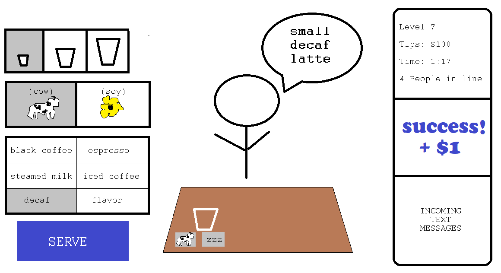

# BaristaMax

## Overview

In this game you are a barista at a busy cafe and have to select the correct ingredients and processes to make coffee drinks as customers order them. The faster you are, the more tips you make!

---
## Motivation
Working in cafes has been one of my favorite jobs. I thought I would make my first game an ode to that. This is a working-in-a-cafe-simulator.

## User Stories

* When player clicks the start button, the timer begins counting down and the first order appears
* when player clicks an icon for an ingredient, the ingredient show up on the counter in the center of the screen
* When a player clicks the 'serve' button with all correct elements selected, the player gets points
* Points are shown as tips
* When the player finishes enough orders correctly before the timer runs out, player wins a sweet prize.

## Wire Frames
# How it started

# How it's going

## Data Structure

* Each category of ingredients and processes can be an array 
* orders are generated by randomly drawing an element from one or more array and saved as an object
* drink served is an object which is then compared to order object

## Approach

My approach was largely functional. I wanted to use variables and logic throughout to ensure that rounds can easily have increased difficulty. For example, the player's goal for each round is a function of the round number.

## Unsolved Problems
* The background image doesn't appear to load on the github-hosted game.
* Would like gameplay divs to have transparent shadow boxes -- don't know if CSS supports that.
* Infinite number of ingredients can be listed on gameplay div. Must figure out how to limit it and adjust css so that 'serve' button does not shrink during game play.

## Upcoming features

* Wildcard events can happen that affect the player's success for better or worse
* When a player clicks on an ingredient, the mutually exclusive ingredients become unclickable
* More levels. Each level is increasingly difficult (bigger orders, more randomization of ingredient location)